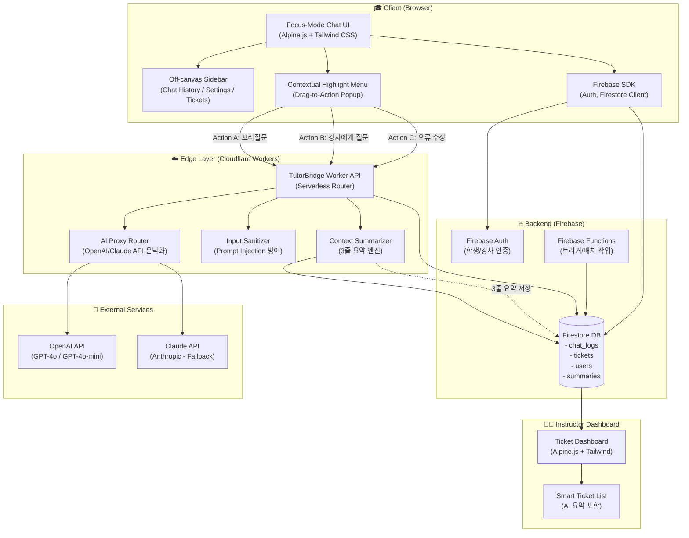
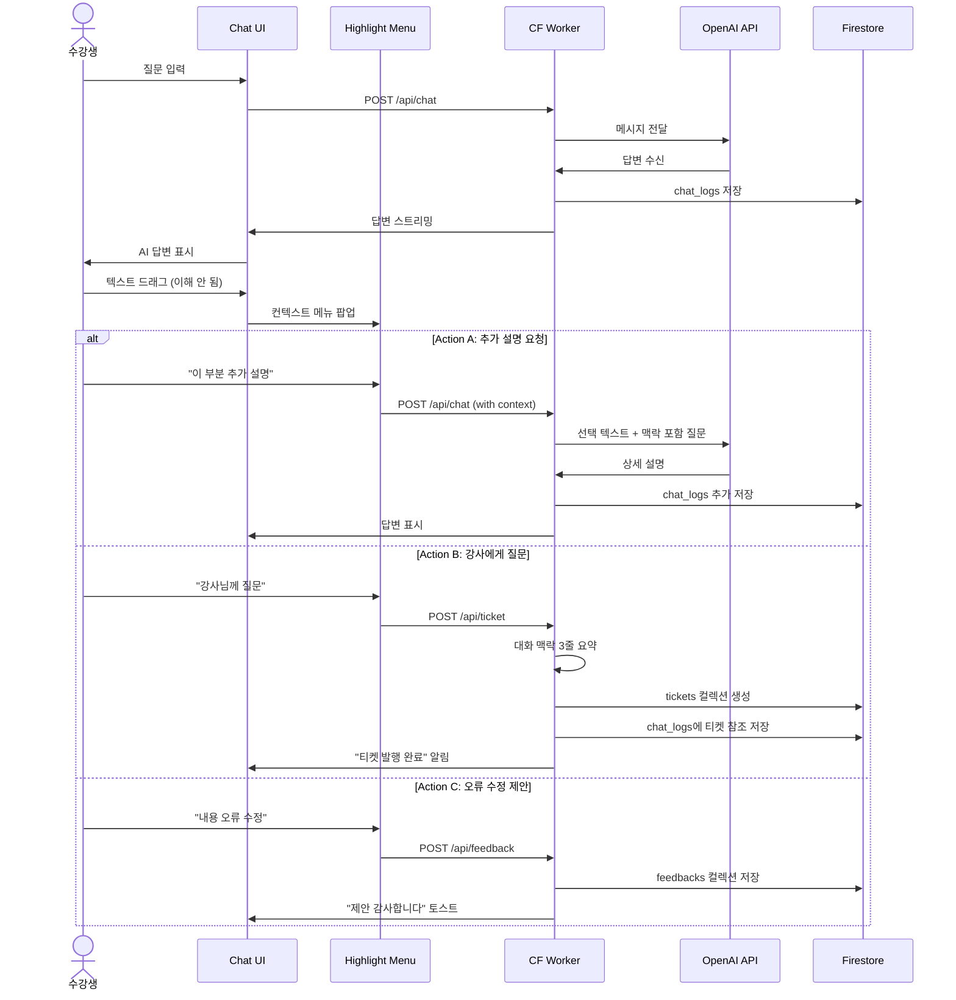
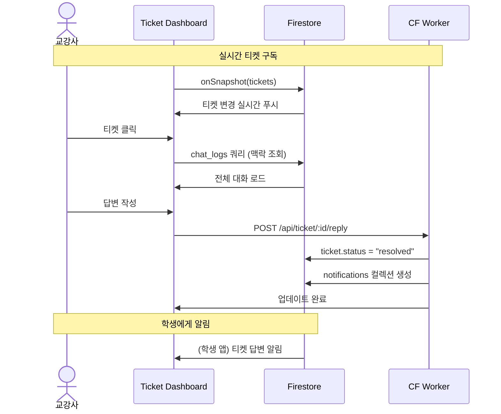
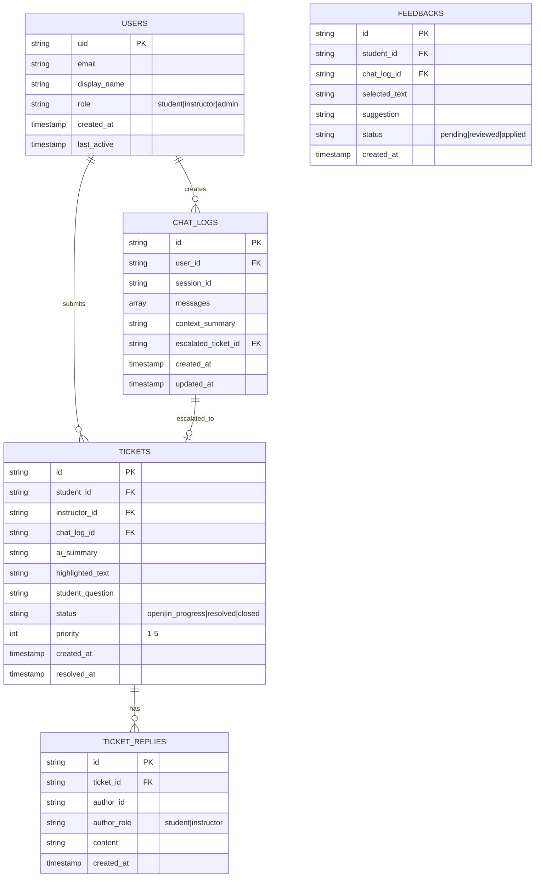
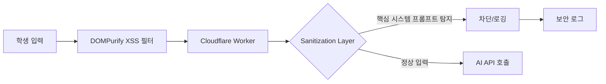
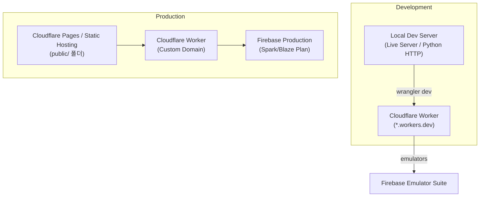

# TutorBridge - High-Level Architecture Design (HLD)

> **Project**: TutorBridge (AI 튜터 기반 스마트 학습 & 질의응답 시스템)  
> **Phase**: 1 (Architecture Design)  
> **Date**: 2026-04-06  
> **Target**: KIT 바이브코딩 공모전 출품작

---

## 1. 개요 (Overview)

### 1.1 프로젝트 목적
TutorBridge는 **비대면/온라인 학습 환경**에서 발생하는 두 가지 핵심 문제를 해결한다:
- **학생 측**: 학습 흐름 단절 (질문에 대한 즉각적 피드백 부재)
- **교강사 측**: 중복 질문에 대한 업무 과부하 및 맥락 파악의 어려움

### 1.2 핵심 가치 제안
- **Focus-Mode 채팅**으로 학습 몰입도 극대화
- **Contextual Highlight Menu**로 즉각적인 꼬리 질문 및 에스컬레이션
- **Smart Escalation**으로 교강사의 파악 시간 최소화 (AI 자동 요약)

---

## 2. 시스템 아키텍처 다이어그램

---

## 3. 기술 스택 선정 및 근거

### 3.1 Frontend Stack (public/)

| 기술 | 용도 | 선정 근거 |
|------|------|----------|
| **Tailwind CSS** | 스타일링 | CDN 기반, 유틸리티 퍼스트, Focus-Mode UI 구현에 최적 |
| **Alpine.js** | 상태관리/상호작용 | Vanilla JS 대비 선언적 문법, CDN 단일 파일, React 대비 가벼움 |
| **DaisyUI** | UI 컴포넌트 | Tailwind 기반 무료 컴포넌트, 사이드바/채팅 버블/모달 등 즉시 활용 |
| **Marked.js** | Markdown 렌더링 | AI 답변의 코드 블록/리스트 서식 지원 |
| **DOMPurify** | XSS 방어 | 학생 입력/AI 출력 Sanitization 필수 |
| **SweetAlert2** | 알림/컨펌 | 직관적 팝업, Highlight Menu 스타일 통일 |
| **Day.js** | 날짜 포맷 | 경량 Moment.js 대체, 채팅 타임스탬프 |

### 3.2 Backend Stack

| 기술 | 용도 | 선정 근거 |
|------|------|----------|
| **Cloudflare Workers** | Serverless API | AI Key 은닉화, Edge 배포, Cold Start 없음, 무료 티어 충분 |
| **Firebase Auth** | 인증 | 이메일/소셜 로그인, 세션 관리, Client SDK와 원클릭 연동 |
| **Firestore** | NoSQL DB | 실시간 동기화, 채팅 로그 스트리밍, 티켓 상태 실시간 반영 |
| **Firebase Analytics** | 학습 분석 | 학생 활동 패턴 추적, 개인정보 비식별화 |

### 3.3 AI/API Stack

| 기술 | 용도 | 선정 근거 |
|------|------|----------|
| **OpenAI GPT-4o** | 메인 AI 튜터 | 빠른 응답, 교육 콘텐츠 이해 우수, JSON Mode 지원 |
| **Claude 3 Haiku** | Fallback/요약 | 맥락 길이 제한 상황, 요약 품질 우수 |
| **Cloudflare AI Gateway** | 프록시/캐싱 | (옵션) 요청 캐싱으로 비용 절감 |

---

## 4. 핵심 기능 흐름 (User Flow)

### 4.1 Focus-Mode 채팅 + Contextual Highlight

### 4.2 Smart Escalation 티켓팅 (교강사 뷰)

---

## 5. 데이터 모델 개요 (Firestore Collections)

---

## 6. 보안 및 프라이버시 설계

### 6.1 Prompt Injection 방어 계층

**구현 포인트**:
- 시스템 프롬프트 구분자 (`###`, `<system>`, `ignore previous`) 필터링
- 입력 길이 제한 (max 4000 tokens)
- 반복 요청 Rate Limiting (분당 30회)

### 6.2 API Key 은닉화

| 구성요소 | 처리방식 |
|---------|---------|
| OpenAI API Key | Cloudflare Workers 환경 변수 |
| Firebase Config | public/js/firebase-init.js (제한된 키만) |
| 서비스 계정 키 | Workers Secrets (암호화) |

---

## 7. 배포 및 인프라 구성

---

## 8. 성능 및 확장성 고려사항

| 영역 | 전략 |
|------|------|
| **채팅 로딩** | Firestore Pagination (최근 50개만, 스크롤 시 추가 로드) |
| **AI 응답 지연** | Streaming 응답 (Server-Sent Events), Typing 인디케이터 |
| **티켓 요약** | Worker에서 비동기 처리, Firestore에 캐싱 |
| **이미지/파일** | Firebase Storage, 10MB 제한, 교육용 파일 형식만 허용 |

---

## 9. 단계별 구현 로드맵

### Phase 2: 설계 상세화
- [ ] architecture-lld.md 작성 (API 스펙, DB 상세 스키마)
- [ ] screen-design.md 작성 (UI 와이어프레임, 반응형 breakpoint)
- [ ] Worker 라우팅 설계 및 테스트 스크립트

### Phase 3: 구현
- [ ] Firebase 초기화 및 인증 구현
- [ ] Focus-Mode 채팅 UI 구현
- [ ] Contextual Highlight Menu 구현
- [ ] Cloudflare Worker AI 프록시 구현
- [ ] 티켓팅 시스템 및 대시보드 구현

### Phase 4: 안전망 및 테스트
- [ ] Prompt Injection 테스트 시나리오
- [ ] XSS/보안 취약점 스캔
- [ ] 성능 테스트 (동시 사용자 100명 기준)
- [ ] AI_REPORT_LOG.md 작성 완료

---

## 10. 참고 및 변경 이력

| 버전 | 날짜 | 작성자 | 변경 내용 |
|------|------|--------|----------|
| v1.0 | 2026-04-06 | Cascade | Phase 1 초기 HLD 작성 |

---

**검증 체크리스트**:
- [x] 모든 Mermaid 다이어그램은 표준 문법 준수 (HTML 태그 미혼용)
- [x] public/ 분리 원칙 반영
- [x] AI API 은닉화 (Worker 경유) 반영
- [x] Firebase 기반 인증/DB 명시
- [x] CDN 라이브러리 스택 명시
