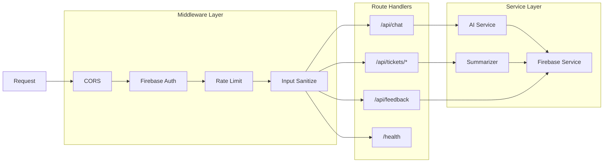

# TutorBridge - Low-Level Architecture Design (LLD)

> **Project**: TutorBridge (AI 튜터 기반 스마트 학습 & 질의응답 시스템)  
> **Phase**: 2 (Detailed Design)  
> **Date**: 2026-04-06  
> **Target**: KIT 바이브코딩 공모전 출품작

---

## 1. API 명세서 (Cloudflare Worker Endpoints)

### 1.1 Base URL

```
Development: https://tutorbridge-dev.{subdomain}.workers.dev
Production:  https://api.tutorbridge.app
```

### 1.2 인증 (Authentication)

모든 API 요청에 Firebase ID Token 필요:
```
Header: Authorization: Bearer {firebase_id_token}
```

---

### 1.3 엔드포인트 상세

#### `POST /api/chat`
AI 튜터와 대화 (Streaming 지원)

**Request:**
```json
{
  "session_id": "string | null",
  "message": "string (max 4000 chars)",
  "context": {
    "highlighted_text": "string | null",
    "previous_context": ["array of previous messages"]
  }
}
```

**Response (Streaming - SSE):**
```
data: {"type": "delta", "content": "chunk of text"}
data: {"type": "delta", "content": "next chunk"}
data: {"type": "complete", "session_id": "sess_abc123", "message_id": "msg_xyz789"}
```

**Error Codes:**
- `400` - Invalid request / Prompt injection detected
- `401` - Unauthorized
- `429` - Rate limit exceeded (30 req/min)
- `502` - AI service error

---

#### `POST /api/chat/:session_id/summarize`
대화 맥락 3줄 요약 생성 (티켓 발행용)

**Request:**
```json
{
  "max_lines": 3
}
```

**Response:**
```json
{
  "success": true,
  "summary": "1. 학생이 이차방정식 풀이에서 근의공식 적용에 어려움을 겪음\n2. AI가 예시와 함께 설명했으나判別식 부분에서 추가 질문 발생\n3. 학생은 D=b²-4ac의 의미를 구체적으로 이해하지 못함",
  "token_used": 245,
  "created_at": "2026-04-06T10:30:00Z"
}
```

---

#### `POST /api/tickets`
강사에게 질문 티켓 발행

**Request:**
```json
{
  "chat_log_id": "string",
  "highlighted_text": "string (드래그한 텍스트)",
  "student_question": "string (추가 설명)",
  "context_summary": "string (자동 생성)",
  "priority": 1
}
```

**Response:**
```json
{
  "success": true,
  "ticket": {
    "id": "ticket_abc123",
    "status": "open",
    "created_at": "2026-04-06T10:30:00Z",
    "estimated_response_time": "2 hours"
  }
}
```

---

#### `GET /api/tickets`
티켓 목록 조회 (학생/강사별 필터링)

**Query Parameters:**
```
role: "student" | "instructor"
status: "open" | "in_progress" | "resolved" | "closed" | "all" (default: all)
limit: number (default: 20, max: 100)
cursor: string (pagination)
```

**Response:**
```json
{
  "success": true,
  "tickets": [
    {
      "id": "ticket_abc123",
      "student_id": "user_def456",
      "student_name": "홍길동",
      "ai_summary": "3줄 요약...",
      "highlighted_text": "判別식 D의 의미",
      "status": "open",
      "priority": 2,
      "created_at": "2026-04-06T10:30:00Z",
      "reply_count": 0
    }
  ],
  "pagination": {
    "has_more": true,
    "next_cursor": "eyJpZCI6..."
  },
  "total_count": 45
}
```

---

#### `GET /api/tickets/:id`
티켓 상세 조회 (전체 대화 맥락 포함)

**Response:**
```json
{
  "success": true,
  "ticket": {
    "id": "ticket_abc123",
    "student_id": "user_def456",
    "student_name": "홍길동",
    "chat_log_id": "chat_ghi789",
    "ai_summary": "3줄 요약...",
    "highlighted_text": "判別식 D의 의미",
    "student_question": "왜 D>0일 때 해가 두 개인가요?",
    "status": "open",
    "priority": 2,
    "created_at": "2026-04-06T10:30:00Z",
    "full_context": {
      "messages": [
        {"role": "user", "content": "이차방정식 푸는 법 알려줘"},
        {"role": "assistant", "content": "근의공식을 사용합니다..."}
      ]
    }
  },
  "replies": [
    {
      "id": "reply_jkl012",
      "author_id": "user_mno345",
      "author_name": "김교수",
      "author_role": "instructor",
      "content": "D는 근의 개수를 판별합니다...",
      "created_at": "2026-04-06T11:00:00Z"
    }
  ]
}
```

---

#### `POST /api/tickets/:id/replies`
티켓 답변 작성 (강사/학생 모두 가능)

**Request:**
```json
{
  "content": "string (max 2000 chars)",
  "author_role": "instructor" | "student"
}
```

**Response:**
```json
{
  "success": true,
  "reply": {
    "id": "reply_jkl012",
    "created_at": "2026-04-06T11:00:00Z"
  },
  "ticket_status": "in_progress"
}
```

---

#### `PATCH /api/tickets/:id/status`
티켓 상태 변경

**Request:**
```json
{
  "status": "in_progress" | "resolved" | "closed",
  "resolution_note": "string (optional)"
}
```

---

#### `POST /api/feedback`
오류 수정 제안 제출

**Request:**
```json
{
  "chat_log_id": "string",
  "selected_text": "string",
  "suggestion": "string (max 1000 chars)",
  "suggestion_type": "error_correction" | "improvement" | "other"
}
```

**Response:**
```json
{
  "success": true,
  "feedback_id": "feedback_pqr789",
  "message": "제안이 접수되었습니다. 검토 후 반영하겠습니다."
}
```

---

## 2. Firestore 상세 스키마

### 2.1 Collection: `users`

```javascript
{
  // Document ID: Firebase Auth UID
  uid: "string",                    // PK (same as doc ID)
  email: "string",                  // unique
  display_name: "string",           // max 50 chars
  role: "student" | "instructor" | "admin",
  
  // Student specific
  student_info: {
    enrolled_courses: ["course_id"], // array of course references
    learning_level: "beginner" | "intermediate" | "advanced",
    preferred_subjects: ["math", "physics"]
  },
  
  // Instructor specific
  instructor_info: {
    department: "string",
    office_hours: "string",
    assigned_courses: ["course_id"],
    max_open_tickets: 20              // 동시 처리 가능 티켓 수
  },
  
  // Metadata
  created_at: Timestamp,
  last_active: Timestamp,
  last_ip: "string",                // 보안용
  
  // Preferences
  preferences: {
    theme: "light" | "dark" | "system",
    language: "ko" | "en",
    notifications: {
      ticket_replied: true,
      new_ticket_assigned: true,
      email_digest: false
    }
  },
  
  // Stats
  stats: {
    total_chat_sessions: 0,
    total_tickets_created: 0,
    total_tickets_resolved: 0,        // for instructors
    avg_response_time: 0              // for instructors (minutes)
  }
}
```

**Indexes:**
- `role` (복합: `role` + `created_at`)
- `instructor_info.assigned_courses` (Array contains)

---

### 2.2 Collection: `chat_sessions`

```javascript
{
  // Document ID: auto-generated
  id: "string",                     // PK
  user_id: "string",                // FK -> users.uid
  
  // Session info
  title: "string",                  // AI가 생성한 세션 제목 (요약)
  subject: "string",                // 과목 태그
  
  // Messages sub-collection 구조 대신 array (성능 고려)
  messages: [
    {
      id: "msg_001",
      role: "user" | "assistant" | "system",
      content: "string",
      timestamp: Timestamp,
      tokens: 150,                    // 토큰 수 (비용 추적)
      
      // Contextual Highlight 정보
      highlight_context: {
        is_followup: false,
        parent_message_id: null,
        highlighted_text: null
      }
    }
  ],
  
  // Escalation 정보
  escalation: {
    is_escalated: false,
    ticket_id: "string | null",     // FK -> tickets.id
    escalated_at: Timestamp | null,
    escalated_message_id: "string"  // 어떤 메시지에서 에스컬레이션됐는지
  },
  
  // AI Summary (자동 생성)
  ai_summary: {
    three_line_summary: "string",
    key_concepts: ["string"],
    student_understanding_level: "confused" | "partial" | "clear",
    generated_at: Timestamp
  },
  
  // Metadata
  created_at: Timestamp,
  updated_at: Timestamp,
  ended_at: Timestamp | null,
  
  // Stats
  message_count: 0,
  total_tokens: 0,                    // 누적 토큰 수
  
  // Settings
  settings: {
    model: "gpt-4o" | "gpt-4o-mini",
    temperature: 0.7,
    max_context_length: 4000
  }
}
```

**Indexes:**
- `user_id` + `created_at` (DESC)
- `escalation.is_escalated` + `escalation.escalated_at`

---

### 2.3 Collection: `tickets`

```javascript
{
  // Document ID: auto-generated (ticket_{timestamp}_{random})
  id: "string",                     // PK
  
  // Relationships
  student_id: "string",             // FK -> users.uid
  instructor_id: "string | null",   // FK -> users.uid (assigned)
  chat_session_id: "string",        // FK -> chat_sessions.id
  
  // Content
  title: "string",                  // AI가 생성한 제목
  ai_summary: "string",             // 3줄 요약 (핵심!)
  highlighted_text: "string",       // 학생이 드래그한 텍스트
  student_question: "string",       // 추가 질문 내용
  
  // Context snapshot (denormalized for performance)
  context_snapshot: {
    subject: "string",
    message_count: 10,
    last_messages: [                  // 마지막 3개 메시지 요약
      {"role": "user", "preview": "이차방정식 질문..."}
    ]
  },
  
  // Status workflow
  status: "open" | "in_progress" | "resolved" | "closed" | "escalated",
  priority: 1 | 2 | 3 | 4 | 5,      // 1=긴급, 5=낮음
  
  // Assignment
  assignment: {
    assigned_at: Timestamp | null,
    assigned_by: "auto" | "string",   // user_id or "auto"
    auto_assign_reason: "string | null"
  },
  
  // Timestamps
  created_at: Timestamp,
  first_response_at: Timestamp | null,
  resolved_at: Timestamp | null,
  closed_at: Timestamp | null,
  
  // SLA tracking
  sla: {
    target_response_minutes: 120,     // 2시간 목표
    actual_response_minutes: null,
    breached: false
  },
  
  // Metrics
  metrics: {
    reply_count: 0,
    student_satisfaction: null,       // 1-5 (해결 후 평가)
    resolution_time_minutes: null
  },
  
  // Tags for categorization
  tags: ["quadratic_equation", "discriminant", "confusion"],
  
  // AI classification
  ai_classification: {
    subject: "math",
    difficulty: "intermediate",
    question_type: "conceptual" | "procedural" | "error_spotting"
  }
}
```

**Indexes:**
- `student_id` + `created_at` (DESC)
- `instructor_id` + `status` + `priority` (DESC)
- `status` + `created_at` (for dashboard)
- `priority` (for urgent queue)

---

### 2.4 Collection: `ticket_replies`

```javascript
{
  // Document ID: auto-generated
  id: "string",                     // PK
  ticket_id: "string",              // FK -> tickets.id
  
  // Author
  author_id: "string",              // FK -> users.uid
  author_name: "string",            // denormalized
  author_role: "student" | "instructor" | "system",
  
  // Content
  content: "string",                // max 2000 chars
  content_type: "text" | "markdown" | "code",
  
  // For instructor replies
  is_resolution: false,               // 이 답변이 해결책인지
  attachments: [
    {
      type: "image" | "file" | "link",
      url: "string",
      name: "string"
    }
  ],
  
  // Metadata
  created_at: Timestamp,
  edited_at: Timestamp | null,
  
  // AI assist (instructor used AI to draft)
  ai_assisted: false,
  ai_draft: "string | null"           // AI가 생성한 초안 (히스토리용)
}
```

**Indexes:**
- `ticket_id` + `created_at` (ASC)

---

### 2.5 Collection: `feedbacks`

```javascript
{
  // Document ID: auto-generated
  id: "string",                     // PK
  
  // Reporter
  student_id: "string",             // FK -> users.uid
  student_name: "string",           // denormalized
  
  // Source
  chat_session_id: "string",        // FK -> chat_sessions.id
  message_id: "string",             // 특정 메시지 참조
  
  // Content
  selected_text: "string",          // 드래그한 텍스트
  suggestion: "string",             // 제안 내용
  suggestion_type: "error_correction" | "improvement" | "factual_error" | "other",
  
  // Additional context
  additional_comment: "string | null",
  
  // Status workflow
  status: "pending" | "under_review" | "accepted" | "rejected" | "implemented",
  
  // Review
  reviewed_by: "string | null",     // FK -> users.uid (admin/instructor)
  reviewed_at: Timestamp | null,
  review_note: "string | null",
  
  // Implementation tracking
  implementation: {
    implemented_at: Timestamp | null,
    implemented_by: "string | null",
    related_change: "string | null"   // git commit or doc ref
  },
  
  // Metadata
  created_at: Timestamp,
  
  // AI initial assessment
  ai_assessment: {
    validity_score: 0.85,           // 0-1, AI가 판단한 제안 타당성
    category: "minor_error" | "major_error" | "clarification",
    confidence: 0.92
  }
}
```

**Indexes:**
- `status` + `created_at`
- `student_id` + `created_at` (DESC)

---

### 2.6 Collection: `notifications`

```javascript
{
  // Document ID: auto-generated
  id: "string",                     // PK
  
  // Target
  user_id: "string",                // FK -> users.uid
  
  // Content
  type: "ticket_replied" | "ticket_assigned" | "ticket_resolved" | "system",
  title: "string",
  body: "string",
  
  // Deep link
  action_url: "/tickets/ticket_abc123",
  
  // Related entities
  related_ticket_id: "string | null",
  related_reply_id: "string | null",
  
  // Status
  is_read: false,
  read_at: Timestamp | null,
  
  // Metadata
  created_at: Timestamp,
  expires_at: Timestamp | null
}
```

**Indexes:**
- `user_id` + `is_read` + `created_at` (DESC)

---

## 3. Worker 라우팅 및 내부 구조

### 3.1 디렉토리 구조

```
worker/
├── src/
│   ├── index.js              // Worker entry point
│   ├── routes/
│   │   ├── chat.js           // /api/chat endpoints
│   │   ├── tickets.js        // /api/tickets endpoints
│   │   ├── feedback.js       // /api/feedback endpoints
│   │   └── health.js         // /health endpoint
│   ├── services/
│   │   ├── ai.js             // OpenAI/Claude 통합
│   │   ├── firebase.js       // Firestore admin operations
│   │   ├── summarizer.js     // 3줄 요약 로직
│   │   └── sanitizer.js      // Input sanitization
│   ├── middleware/
│   │   ├── auth.js           // Firebase token verification
│   │   ├── rateLimit.js      // Rate limiting
│   │   ├── cors.js           // CORS handling
│   │   └── errorHandler.js   // Global error handling
│   ├── utils/
│   │   ├── constants.js      // 상수 정의
│   │   ├── helpers.js        // 유틸 함수
│   │   └── validators.js     // 입력 검증
│   └── types/
│       └── index.js          // JSDoc 타입 정의
├── wrangler.toml             // Cloudflare 설정
├── .env.example              // 환경 변수 예시
└── package.json
```

### 3.2 라우팅 다이어그램



### 3.3 핵심 로직: 3줄 요약 생성

```javascript
// src/services/summarizer.js
async function generateThreeLineSummary(chatSession) {
  const messages = chatSession.messages.slice(-10); // 최근 10개만
  
  const prompt = `다음 학생과 AI 튜터의 대화를 3줄로 요약해주세요.
요구사항:
1. 학생이 어떤 개념에서 어려움을 겪는지
2. AI가 어떤 방식으로 설명했는지  
3. 현재 학생의 이해 수준이 어떤지

대화:
${formatMessages(messages)}

형식: 1. ... 2. ... 3. ...
총 글자수: 150자 이내`;

  const summary = await aiService.complete(prompt, {
    model: 'gpt-4o-mini',
    max_tokens: 150,
    temperature: 0.3
  });
  
  return {
    summary: summary.trim(),
    token_used: summary.tokens,
    generated_at: new Date().toISOString()
  };
}
```

### 3.4 핵심 로직: Prompt Injection 방어

```javascript
// src/services/sanitizer.js
const DANGEROUS_PATTERNS = [
  /###\s*system/i,
  /<system>/i,
  /ignore\s+previous\s+instructions?/i,
  /ignore\s+above/i,
  /you\s+are\s+now/i,
  /DAN\s*mode/i,
  /jailbreak/i,
  /\[system\s*prompt\]/i,
  /\(system\s*prompt\)/i,
  /<!--\s*system/i,
];

const MAX_INPUT_LENGTH = 4000;

function sanitizeInput(input) {
  // 길이 검증
  if (input.length > MAX_INPUT_LENGTH) {
    throw new Error('Input too long');
  }
  
  // 패턴 검출
  for (const pattern of DANGEROUS_PATTERNS) {
    if (pattern.test(input)) {
      logSecurityEvent('PROMPT_INJECTION_ATTEMPT', input);
      throw new Error('Invalid input pattern detected');
    }
  }
  
  // 특수문자 이스케이프 (기본)
  return input
    .replace(/[<>]/g, '')
    .trim();
}
```

---

## 4. 실시간 동기화 설계

### 4.1 Firestore onSnapshot 구독

```javascript
// Client-side: Firebase SDK
// 채팅 실시간 업데이트
db.collection('chat_sessions')
  .doc(sessionId)
  .onSnapshot((doc) => {
    const data = doc.data();
    updateChatUI(data.messages);
  });

// 티켓 상태 실시간 반영 (강사 대시보드)
db.collection('tickets')
  .where('instructor_id', '==', currentUser.uid)
  .where('status', 'in', ['open', 'in_progress'])
  .orderBy('priority', 'desc')
  .orderBy('created_at', 'asc')
  .onSnapshot((snapshot) => {
    const tickets = snapshot.docs.map(d => d.data());
    updateTicketDashboard(tickets);
  });
```

### 4.2 Connection State Handling

```javascript
// 연결 상태 모니터링
firebase.firestore().enableNetwork();

firebase.firestore().onSnapshot(
  { includeMetadataChanges: true },
  (snapshot) => {
    const source = snapshot.metadata.fromCache ? 'local' : 'server';
    updateConnectionStatus(source);
  }
);
```

---

## 5. 에러 코드 및 처리

### 5.1 표준 에러 응답 형식

```json
{
  "success": false,
  "error": {
    "code": "TICKET_NOT_FOUND",
    "message": "요청하신 티켓을 찾을 수 없습니다.",
    "details": {
      "ticket_id": "ticket_invalid"
    },
    "request_id": "req_abc123"
  }
}
```

### 5.2 에러 코드 정의

| 코드 | HTTP Status | 설명 | 클라이언트 처리 |
|------|-------------|------|----------------|
| `UNAUTHORIZED` | 401 | 인증 실패 | 로그인 페이지로 리다이렉트 |
| `FORBIDDEN` | 403 | 권한 없음 | 접근 불가 알림 |
| `RATE_LIMIT_EXCEEDED` | 429 | 요청 한도 초과 | 재시도 타이머 표시 |
| `INVALID_INPUT` | 400 | 잘못된 입력 | 입력 필드 오류 표시 |
| `PROMPT_INJECTION_DETECTED` | 400 | 보안 위반 | 차단 알림, 로깅 |
| `AI_SERVICE_ERROR` | 502 | AI 서비스 장애 | Fallback 모델 시도 |
| `TICKET_NOT_FOUND` | 404 | 티켓 없음 | 404 페이지 |
| `SESSION_EXPIRED` | 401 | 세션 만료 | 재로그인 요청 |

---

## 6. 변경 이력

| 버전 | 날짜 | 작성자 | 변경 내용 |
|------|------|--------|----------|
| v1.0 | 2026-04-06 | Cascade | Phase 2 초기 LLD 작성 - API 스펙, DB 스키마, Worker 구조 |

---

**다음 단계**: Phase 3 구현 시작 (Firebase 초기화 → Focus-Mode UI → Worker 배포)
