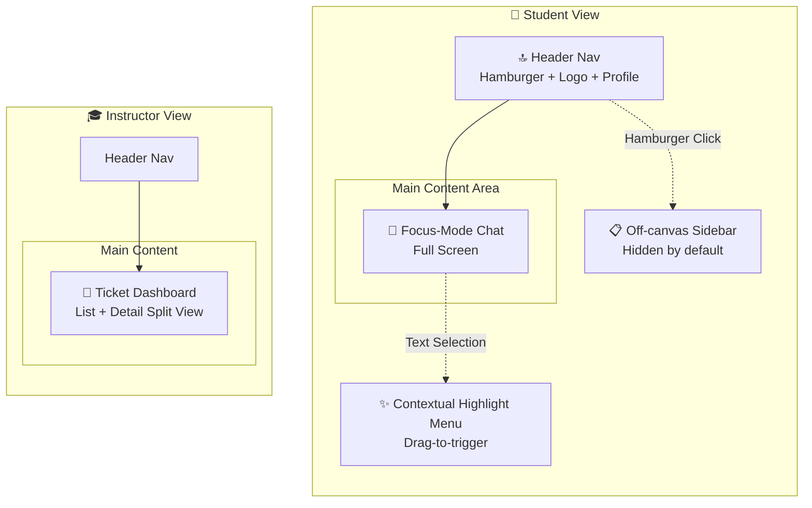

# TutorBridge - Screen Design Document

> **Project**: TutorBridge (AI 튜터 기반 스마트 학습 & 질의응답 시스템)  
> **Phase**: 2 (Screen Design)  
> **Date**: 2026-04-06  
> **Target**: KIT 바이브코딩 공모전 출품작

---

## 1. 디자인 시스템 개요

### 1.1 디자인 원칙
- **Focus-First**: 학습 몰입을 위해 모든 UI 요소는 필요할 때만 등장
- **Progressive Disclosure**: 복잡한 기능은 컨텍스트에 따라 단계적으로 노출
- **Calm Technology**: 학습 스트레스를 줄이는 차분한 색상과 적절한 여백

### 1.2 색상 팔레트

```css
:root {
  /* Primary - Trust & Learning */
  --primary-50: #eff6ff;
  --primary-100: #dbeafe;
  --primary-200: #bfdbfe;
  --primary-500: #3b82f6;
  --primary-600: #2563eb;
  --primary-700: #1d4ed8;
  
  /* Secondary - Warmth */
  --secondary-50: #fefce8;
  --secondary-100: #fef9c3;
  --secondary-500: #eab308;
  --secondary-600: #ca8a04;
  
  /* Accent - Action */
  --accent-500: #10b981;    /* Success/Resolve */
  --accent-600: #059669;
  --warning-500: #f59e0b;  /* Pending */
  --danger-500: #ef4444;    /* Error/Close */
  
  /* Neutral */
  --gray-50: #f9fafb;
  --gray-100: #f3f4f6;
  --gray-200: #e5e7eb;
  --gray-300: #d1d5db;
  --gray-500: #6b7280;
  --gray-600: #4b5563;
  --gray-700: #374151;
  --gray-900: #111827;
  
  /* Background */
  --bg-primary: #ffffff;
  --bg-secondary: #f8fafc;
  --bg-chat: linear-gradient(180deg, #f8fafc 0%, #f1f5f9 100%);
  
  /* Text */
  --text-primary: #111827;
  --text-secondary: #6b7280;
  --text-muted: #9ca3af;
  
  /* Shadows */
  --shadow-sm: 0 1px 2px 0 rgb(0 0 0 / 0.05);
  --shadow-md: 0 4px 6px -1px rgb(0 0 0 / 0.1);
  --shadow-lg: 0 10px 15px -3px rgb(0 0 0 / 0.1);
  --shadow-highlight: 0 8px 25px -5px rgb(59 130 246 / 0.3);
}
```

### 1.3 타이포그래피

```css
/* Font Stack */
--font-sans: 'Pretendard', -apple-system, BlinkMacSystemFont, 'Segoe UI', sans-serif;
--font-mono: 'JetBrains Mono', 'Fira Code', monospace;

/* Scale */
--text-xs: 0.75rem;    /* 12px */
--text-sm: 0.875rem;   /* 14px */
--text-base: 1rem;     /* 16px */
--text-lg: 1.125rem;   /* 18px */
--text-xl: 1.25rem;    /* 20px */
--text-2xl: 1.5rem;    /* 24px */

/* Line Height */
--leading-tight: 1.25;
--leading-normal: 1.5;
--leading-relaxed: 1.625;
```

### 1.4 Spacing & Layout

```css
/* Spacing Scale */
--space-1: 0.25rem;   /* 4px */
--space-2: 0.5rem;    /* 8px */
--space-3: 0.75rem;   /* 12px */
--space-4: 1rem;      /* 16px */
--space-6: 1.5rem;    /* 24px */
--space-8: 2rem;      /* 32px */

/* Border Radius */
--radius-sm: 0.375rem;
--radius-md: 0.5rem;
--radius-lg: 0.75rem;
--radius-xl: 1rem;
--radius-full: 9999px;
```

---

## 2. 화면 구조 (Page Layout)

### 2.1 Overall Layout Architecture



### 2.2 반응형 브레이크포인트

| Breakpoint | Width | Layout Changes |
|------------|-------|----------------|
| **Mobile** | < 640px | Single column, sidebar becomes full-screen overlay |
| **Tablet** | 640px - 1024px | Sidebar collapsible, chat maintains focus |
| **Desktop** | > 1024px | Sidebar can be pinned, max-width container for chat |
| **Large** | > 1440px | Centered layout with side margins |

---

## 3. 화면 상세 설계

### 3.1 학생 뷰: Focus-Mode 채팅 화면

#### Layout Structure
```
┌─────────────────────────────────────────────────────┐
│  ☰  TutorBridge                    👤  ⚙️          │  Header (56px)
├─────────────────────────────────────────────────────┤
│                                                     │
│   ┌─────────────────────────────────────────────┐   │
│   │  🤖 안녕하세요! 무엇을 도와드릴까요?        │   │
│   │                                              │   │
│   │  • 수학 문제 풀이                            │   │  Chat Area
│   │  • 개념 설명 요청                            │   │  (flex-grow)
│   │  • 학습 계획 상담                            │   │
│   └─────────────────────────────────────────────┘   │
│                                                     │
│        ┌─────────────────────────────────┐          │
│        │ 🧑‍🎓 이차방정식 풀이법 알려줘    │          │
│        └─────────────────────────────────┘          │
│                                                     │
│   ┌─────────────────────────────────────────────┐   │
│   │  🤖 이차방정식 ax² + bx + c = 0의 풀이는   │   │
│   │     근의공식을 사용합니다...               │   │
│   │                                              │   │
│   │     [여기서 텍스트 드래그!]                 │   │
│   │                                              │   │
│   │     💡 팁:判別식 D = b² - 4ac로 해의 개수   │   │
│   │        를 미리 확인하세요.                  │   │
│   └─────────────────────────────────────────────┘   │
│                                                     │
├─────────────────────────────────────────────────────┤
│  ┌──────────────────────────────────────────┐  📎   │  Input Area
│  │  메시지를 입력하세요...                   │       │  (80px)
│  └──────────────────────────────────────────┘  ➤   │
└─────────────────────────────────────────────────────┘
```

#### Component Specs

**Header (56px height)**
```
Position: fixed top
Background: white with blur backdrop
Border-bottom: 1px solid var(--gray-200)
Z-index: 50

Left: ☰ Hamburger (24px, gray-600)
Center: Logo "TutorBridge" (text-lg, font-semibold)
Right: 👤 Avatar + ⚙️ Settings (24px icons)
```

**Chat Message Bubbles**
```
/* Student Message */
Background: var(--primary-600)
Text: white
Border-radius: var(--radius-lg) var(--radius-lg) 4px var(--radius-lg)
Max-width: 85%
Padding: var(--space-3) var(--space-4)

/* AI Message */
Background: white
Border: 1px solid var(--gray-200)
Text: var(--text-primary)
Border-radius: 4px var(--radius-lg) var(--radius-lg) var(--radius-lg)
Max-width: 90%
Padding: var(--space-4)
Box-shadow: var(--shadow-sm)

/* Code Blocks inside AI Message */
Background: var(--gray-900)
Text: #e5e7eb
Font: var(--font-mono)
Border-radius: var(--radius-md)
Padding: var(--space-4)
Overflow-x: auto
```

**Input Area (80px)**
```
Position: fixed bottom
Background: white
Border-top: 1px solid var(--gray-200)
Padding: var(--space-4)

Input Field:
  Background: var(--gray-100)
  Border-radius: var(--radius-full)
  Padding: var(--space-3) var(--space-4)
  Focus: ring-2 ring-primary-500

Send Button:
  Size: 40px circle
  Background: var(--primary-600)
  Icon: → (white)
  Hover: scale(1.05)

Attachment:
  Icon: 📎
  Color: var(--gray-500)
```

---

### 3.2 Contextual Highlight Menu (핵심 기능)

#### Trigger Condition
- 사용자가 AI 메시지 내 텍스트를 드래그/선택
- 선택 텍스트 길이 ≥ 10자
- 0.5초 후 자동으로 팝업 등장 (debounced)

#### Popup Positioning
```
┌─────────────────────────────────────────────┐
│  ...이차방정식 ax² + bx + c = 0의 풀이는     │
│     근의공식을 사용합니다...               │
│                                              │
│     [🖱️ 드래그된 텍스트: "判別식 D"]         │
│          ↑                                   │
│    ┌─────────────────────────┐              │
│    │ 💡 추가 설명해줘       │              │  Popup
│    │ 🎫 강사님께 질문       │              │  (정중앙)
│    │ ✏️ 오류 수정 제안      │              │
│    └─────────────────────────┘              │
│                                              │
│     팁:判別식 D = b² - 4ac로 해의 개수를    │
│        미리 확인하세요.                      │
└─────────────────────────────────────────────┘
```

#### Component Specs

```css
.highlight-popup {
  /* Position */
  position: absolute;
  transform: translateX(-50%);
  margin-top: 8px;
  
  /* Visual */
  background: white;
  border-radius: var(--radius-lg);
  box-shadow: var(--shadow-highlight);
  border: 1px solid var(--primary-200);
  
  /* Animation */
  animation: popup-in 0.2s ease-out;
  
  /* Content */
  display: flex;
  flex-direction: column;
  gap: 4px;
  padding: 8px;
  min-width: 180px;
}

@keyframes popup-in {
  from {
    opacity: 0;
    transform: translateX(-50%) translateY(-10px) scale(0.95);
  }
  to {
    opacity: 1;
    transform: translateX(-50%) translateY(0) scale(1);
  }
}

.popup-action {
  display: flex;
  align-items: center;
  gap: 8px;
  padding: 10px 14px;
  border-radius: var(--radius-md);
  font-size: var(--text-sm);
  color: var(--gray-700);
  cursor: pointer;
  transition: all 0.15s;
}

.popup-action:hover {
  background: var(--primary-50);
  color: var(--primary-700);
}

.popup-action.primary {
  background: var(--primary-600);
  color: white;
}

.popup-action.primary:hover {
  background: var(--primary-700);
}
```

#### Action Details

| Action | Icon | Primary? | Description |
|--------|------|----------|-------------|
| **추가 설명 요청** | 💡 | Yes | AI에게 꼬리 질문, 현재 창에서 계속 |
| **강사님께 질문** | 🎫 | Yes | 티켓 발행, 사이드바에서 상태 확인 |
| **오류 수정 제안** | ✏️ | No | 피드백 제출, 토스트 알림만 |

---

### 3.3 Off-canvas Sidebar

#### Trigger
- 헤더 햄버거 버튼 클릭
- 스와이프 제스처 (모바일: 왼쪽에서 오른쪽으로)

#### Layout
```
┌─────────────────────────────────────────────────────────────┐
│ Sidebar (320px)        │  Main Content (dimmed overlay)     │
│                        │                                    │
│  👤 홍길동님           │                                    │
│  🎓 수강생             │  ┌────────────────────────────┐  │
│                        │  │  Chat content...            │  │
│  ─────────────────     │  │                             │  │
│  📜 대화 기록          │  │                             │  │
│  ├── 수학 1 (어제)     │  └────────────────────────────┘  │
│  ├── 물리학 (3일 전)   │                                    │
│  └── 화학 개론 (주)    │                                    │
│                        │                                    │
│  ─────────────────     │                                    │
│  🎫 나의 질문          │                                    │
│  ├── 🟡判別식 질문     │                                    │
│  ├── 🟢이차함수 그래프 │                                    │
│  └── ⚫적분 문제       │                                    │
│                        │                                    │
│  ─────────────────     │                                    │
│  ⚙️ 설정               │                                    │
│  🚪 로그아웃           │                                    │
│                        │                                    │
└─────────────────────────────────────────────────────────────┘
```

#### Animation Specs
```css
.sidebar {
  position: fixed;
  left: 0;
  top: 0;
  width: 320px;
  height: 100vh;
  background: white;
  z-index: 100;
  transform: translateX(-100%);
  transition: transform 0.3s cubic-bezier(0.4, 0, 0.2, 1);
}

.sidebar.open {
  transform: translateX(0);
}

.sidebar-overlay {
  position: fixed;
  inset: 0;
  background: rgba(0, 0, 0, 0.5);
  opacity: 0;
  visibility: hidden;
  transition: opacity 0.3s, visibility 0.3s;
  z-index: 99;
}

.sidebar-overlay.open {
  opacity: 1;
  visibility: visible;
}
```

---

### 3.4 교강사 뷰: Ticket Dashboard

#### Layout Structure
```
┌─────────────────────────────────────────────────────────────────────┐
│  TutorBridge  Instructor            🔔  👤  김교수님               │
├─────────────────────────────────────────────────────────────────────┤
│  ┌──────────────────┐  ┌──────────────────────────────────────┐  │
│  │ 🎫 티켓 목록      │  │ 티켓 상세                            │  │
│  │                   │  │                                      │  │
│  │ 🔴 긴급 (2)       │  │ #1234:判別식 의미 질문              │  │
│  │ ─────────────     │  │                                      │  │
│  │ ▶ 🚨判別식 D      │  │ 🧑‍🎓 홍길동 | 10분 전 | 수학Ⅱ       │  │
│  │    "이차방정식..."│  │                                      │  │
│  │    1. 학생이...   │  │ 📋 AI 요약:                          │  │
│  │    2. AI가...     │  │ 1. 이차방정식 근의공식 적용에서    │  │
│  │    3. 현재...     │  │    어려움을 겪음                     │  │
│  │                   │  │ 2. AI가 예시로 설명했으나...        │  │
│  │ 🟡 대기중 (5)     │  │ 3. D=b²-4ac의 의미 이해 불가       │  │
│  │ ─────────────     │  │                                      │  │
│  │   적분의 정의     │  │ 💬 전체 대화 맥락:                  │  │
│  │   삼각함수...     │  │ ┌────────────────────────────────┐  │  │
│  │   ...             │  │ │ 학생: 이차방정식 푸는 법?      │  │  │
│  │                   │  │ │ AI: 근의공식은...              │  │  │
│  │ 🟢 처리중 (3)     │  │ │ 학생: 여기서 [判別식] 뭔가요?   │  │  │
│  │ ─────────────     │  │ └────────────────────────────────┘  │  │
│  │                   │  │                                      │  │
│  │ ⚫ 해결됨 (28)    │  │ 📝 답변 작성:                       │  │
│  │                   │  │ ┌────────────────────────────────┐  │  │
│  │                   │  │ │                                │  │  │
│  │                   │  │ │  D는 근의 개수를 판별합니다... │  │  │
│  │                   │  │ │                                │  │  │
│  │                   │  │ └────────────────────────────────┘  │  │
│  │                   │  │                    [✓ 해결] [💾 저장]│  │
│  │                   │  │                                      │  │
│  └──────────────────┘  └──────────────────────────────────────┘  │
└─────────────────────────────────────────────────────────────────────┘
```

#### Component Specs

**Ticket List Panel (380px, fixed)**
```css
.ticket-list-panel {
  width: 380px;
  background: var(--gray-50);
  border-right: 1px solid var(--gray-200);
  display: flex;
  flex-direction: column;
}

.ticket-category {
  padding: var(--space-4);
  font-weight: 600;
  display: flex;
  align-items: center;
  gap: var(--space-2);
}

.ticket-item {
  padding: var(--space-4);
  background: white;
  border-bottom: 1px solid var(--gray-200);
  cursor: pointer;
  transition: background 0.15s;
}

.ticket-item:hover {
  background: var(--primary-50);
}

.ticket-item.active {
  background: white;
  border-left: 3px solid var(--primary-600);
}

/* Priority Indicators */
.priority-urgent { border-left: 3px solid var(--danger-500); }
.priority-high { border-left: 3px solid var(--warning-500); }
.priority-normal { border-left: 3px solid var(--primary-500); }
.priority-low { border-left: 3px solid var(--gray-400); }
```

**Ticket Detail Panel (flex-grow)**
```css
.ticket-detail {
  flex: 1;
  padding: var(--space-6);
  overflow-y: auto;
}

.ai-summary-box {
  background: linear-gradient(135deg, var(--primary-50) 0%, white 100%);
  border: 1px solid var(--primary-200);
  border-radius: var(--radius-lg);
  padding: var(--space-6);
}

.context-preview {
  background: var(--gray-50);
  border-radius: var(--radius-md);
  padding: var(--space-4);
  font-family: var(--font-mono);
  font-size: var(--text-sm);
}

.reply-editor {
  border: 2px solid var(--gray-300);
  border-radius: var(--radius-lg);
  min-height: 120px;
  padding: var(--space-4);
}

.reply-editor:focus {
  border-color: var(--primary-500);
  outline: none;
}
```

---

## 4. 상태 및 인터랙션 정의

### 4.1 Chat States

| State | Visual | Description |
|-------|--------|-------------|
| **Empty** | AI 환영 메시지 + 추천 주제 | 첫 진입 시 |
| **Typing** | 입력 중 표시 + 전송 버튼 로딩 | 메시지 입력 중 |
| **AI Thinking** | ⏳ Typing indicator | AI 응답 대기 |
| **Streaming** | 단어 단위로 나타나는 텍스트 | SSE 응답 수신 중 |
| **Error** | ⚠️ 재시도 버튼 | AI 서비스 오류 |
| **Highlight Active** | 팝업 메뉴 노출 | 텍스트 선택 중 |

### 4.2 Sidebar States

| State | Position | Overlay |
|-------|----------|---------|
| **Hidden** | `translateX(-100%)` | Hidden |
| **Visible** | `translateX(0)` | Visible |
| **Pinned** (Desktop only) | `translateX(0)` | No overlay |

---

## 5. 애니메이션 라이브러리 사용

### 5.1 AOS (Animate On Scroll)
```html
<!-- CDN -->
<script src="https://unpkg.com/aos@2.3.1/dist/aos.js"></script>

<!-- Usage for message appear -->
<div class="chat-message" data-aos="fade-up" data-aos-duration="300">
```

### 5.2 CSS Transitions (권장)
```css
/* Message appear */
.message-enter {
  animation: message-in 0.3s ease-out;
}

@keyframes message-in {
  from {
    opacity: 0;
    transform: translateY(10px);
  }
  to {
    opacity: 1;
    transform: translateY(0);
  }
}

/* Typing dots */
.typing-indicator span {
  animation: typing-bounce 1.4s infinite;
}

.typing-indicator span:nth-child(2) { animation-delay: 0.2s; }
.typing-indicator span:nth-child(3) { animation-delay: 0.4s; }

@keyframes typing-bounce {
  0%, 60%, 100% { transform: translateY(0); }
  30% { transform: translateY(-4px); }
}
```

---

## 6. 파일 구조

```
public/
├── index.html                    # 메인 진입점 (Student View)
├── instructor.html               # 강사 대시보드
├── login.html                    # 인증 페이지
├── css/
│   ├── variables.css             # CSS Custom Properties
│   ├── base.css                  # Reset & Base styles
│   ├── components/
│   │   ├── chat.css              # Chat bubbles & input
│   │   ├── sidebar.css           # Off-canvas sidebar
│   │   ├── highlight-menu.css    # Contextual popup
│   │   └── ticket-dashboard.css  # Instructor view
│   └── utilities.css             # Helper classes
├── js/
│   ├── firebase-init.js          # Firebase config (from set.md)
│   ├── app.js                    # Alpine.js main app
│   ├── components/
│   │   ├── chat.js               # Chat logic
│   │   ├── sidebar.js            # Sidebar toggle
│   │   ├── highlight.js          # Text selection & popup
│   │   └── tickets.js            # Ticket operations
│   └── utils/
│       ├── api.js                # Worker API client
│       ├── helpers.js            # Utility functions
│       └── validators.js         # Input validation
└── assets/
    ├── fonts/
    └── icons/
```

---

## 7. 변경 이력

| 버전 | 날짜 | 작성자 | 변경 내용 |
|------|------|--------|----------|
| v1.0 | 2026-04-06 | Cascade | Phase 2 초기 화면 설계 - 디자인 시스템, 레이아웃, 컴포넌트 스펙 |

---

**다음 단계**: Phase 3 구현 시작 - `public/` 폴더에 실제 HTML/CSS/JS 파일 생성
